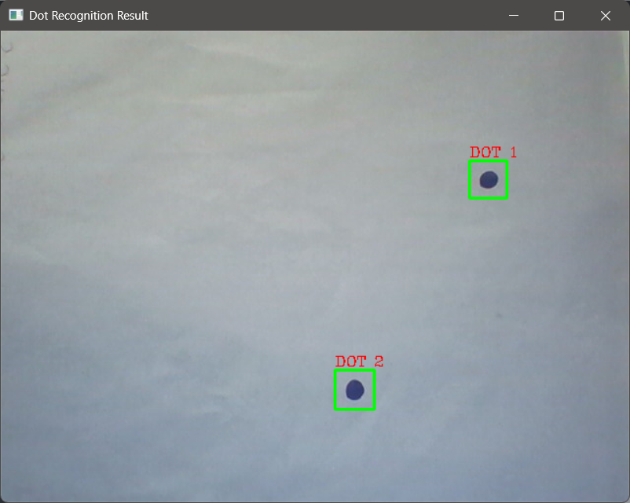
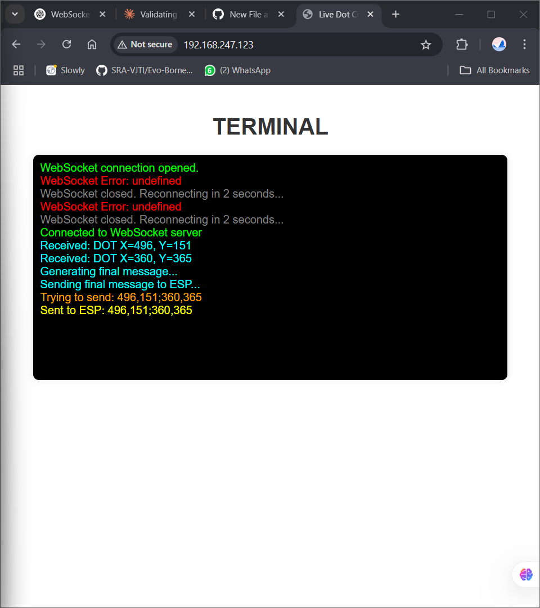
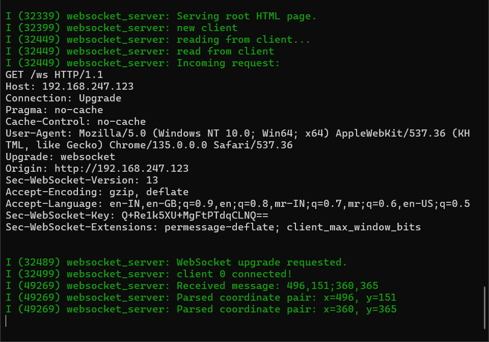

# 3D-Cartesian-Bot

This project implements a 3D Cartesian robotic system controlled by an ESP32 microcontroller.
It utilizes the ESP32's RMT (Remote Control) peripheral to generate precise stepper motor control signals for 3 NEMA17 motors, enabling smooth motion profiles with acceleration, constant speed, and deceleration phases.
The system is designed for applications requiring precise linear movements, specifically to replicate the motion of surgical incisions used in real-life medical procedures.

The system uses OpenCV to recognize dots on paper, transferring the coordinates to a web interface and then to the ESP32 for controlling stepper motors. The ESP32 posts log statements on the ESP-IDF terminal to simulate motor movements between coordinate sets, replicating the transition between points accurately.

In the current logic, the OpenCV Python script captures frames from a webcam and detects circular blobs (dots) when the user presses P. Detected dot coordinates are pushed into a queue and sent via a WebSocket server (running on localhost:9000). The HTML page connects to this WebSocket and receives dot coordinates live. These are displayed on the page and stored in an array. After 2 seconds of inactivity, the full list of coordinates is formatted and sent to another WebSocket connection linked to the ESP32 (ws://192.168.x.x/ws). The ESP32 then processes these coordinates for motor movement.


### Please find the GitHub repository for MCP23017–ESP32 interfacing over I2C here:
🔗 [MCP23017–ESP32 Interfacing Repository](https://github.com/AmeyaTikhe/MCP23017-ESP32Interfacing)

This project demonstrates the implementation of I2C communication between the ESP32 and the MCP23017 I/O expander, including initialization, register read/write operations, and GPIO control.

---

## Table of Contents
1. [Features](#features)
2. [Simulation](#simulation)
3. [Step-by-Step Procedure](#step-by-step-procedure)
    - [Flash the ESP32 Code](#flash-the-esp32-code)
    - [Connect to Wi-Fi](#connect-to-wi-fi)
    - [Open the Web Interface](#open-the-web-interface)
    - [Run the OpenCV Detection](#run-the-opencv-detection)
    - [Capture Coordinates](#capture-coordinates)
    - [Exit the Program](#exit-the-program)
4. [Project Workflow](#project-workflow)
5. [Prerequisites](#prerequisites)

---

## Features

- **Smooth Stepper Motor Control**: Generates stepper motor signals with acceleration and deceleration phases using the ESP32's RMT peripheral.
- **OpenCV Integration**: Utilizes OpenCV for computer vision tasks, potentially enabling features like dot detection or path planning.
- **WebSocket Frontend**: Provides a mock terminal frontend for data tranfer information.

---

## Simulation

### OpenCV processed Camera Feed:



### Web Server Mock Terminal:



### ESP-IDF Terminal:



---


## Step-by-Step Procedure

1. **Flash the ESP32 Code**
   - Open the ESP32 WebSocket project in VS Code (using PlatformIO or ESP-IDF).
   - Build and flash the firmware to the ESP32 using:
     ```bash
     idf.py build
     idf.py -p <your_port> flash
     ```

2. **Connect to Wi-Fi**
   - After flashing, monitor the ESP32 output:
     ```bash
     idf.py -p <your_port> monitor
     ```
   - Note the **local IP address** assigned to the ESP32 (e.g., `192.168.1.123`).

3. **Open the Web Interface**
   - In the `index.html` file, update the WebSocket IP:
     ```js
     let ESPsocket = new WebSocket("ws://192.168.1.123/ws");
     ```
   - Open `index.html` in your browser.
   - It will display a terminal-like interface showing status and coordinates.

4. **Run the OpenCV Detection**
   - Open `dot_websocket.py` in VS Code or another IDE.
   - Run it using:
     ```bash
     python dot_websocket.py
     ```
   - A webcam feed will appear showing the live video.

5. **Capture Coordinates**
   - Press `P` to capture a frame.
   - The script detects dot coordinates and sends them to the web browser via WebSocket.
   - After 2 seconds of inactivity, all collected coordinates are sent to the ESP32.

6. **Exit the Program**
   - Press `D` in the OpenCV window to stop the script.
   - Close the browser tab when finished.

---

## Project Workflow

- Learnt OpenCV functions and image processing techniques and implemented blob detection to detect the dots on a snapshot of the camera feed.
- Created a mock terminal on the web server using HTML, CSS, and JavaScript and connected it to OpenCV using WebSocket to transmit the coordinate data.
- Adapted RMT code from the ESP-IDF RMT GitHub repository for controlling 3 motors.
- Linked the ESP32 code with the web server through WebSocket to receive coordinates and control the robot's movement and built a coordinate set transfer logic for the same.
- Currently woking on the design of a custom PCB to run three NEMA17 stepper motors using an ESP32 microcontroller, that is also compatible with a customized Creality Ender 3 V2 3D printer assembly.
- Also exploring the implementation of machine learning to recognize dot patterns and categorize them into different types of surgical incisions, allowing for path planning based on incision type and simulating the process by actuating a pen to connect dots drawn on a reusable sheet.

---

## Prerequisites

- ESP32 development board.
- ESP-IDF development environment set up on your system.
